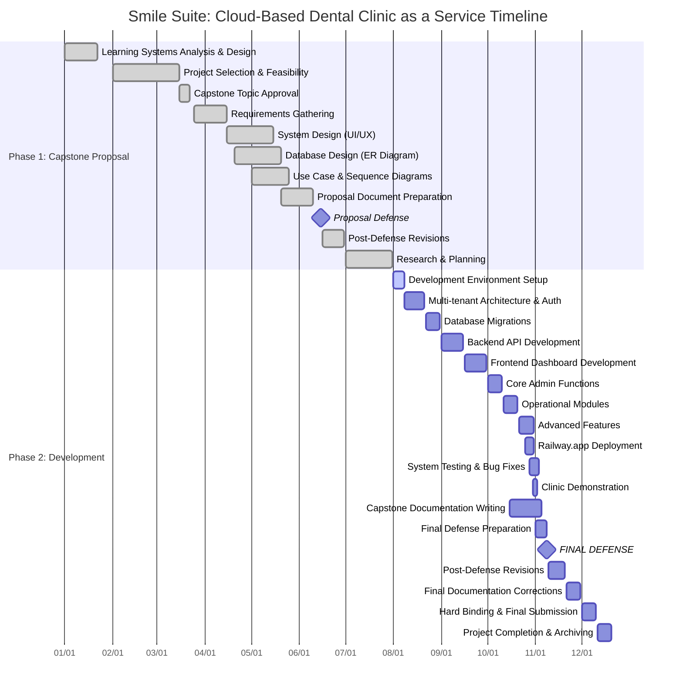

```mermaid
gantt
    title Smile Suite: Cloud-Based Dental Clinic as a Service Timeline
    dateFormat  YYYY-MM-DD
    axisFormat  %m/%d

    section Phase 1: Capstone Proposal
    Learning Systems Analysis & Design    :done, sad, 2024-01-01, 21d
    Project Selection & Feasibility       :done, feas, 2024-02-01, 43d
    Capstone Topic Approval               :done, approval, 2024-03-15, 7d
    Requirements Gathering                 :done, req, 2024-03-25, 21d
    System Design (UI/UX)                 :done, design, 2024-04-15, 30d
    Database Design (ER Diagram)          :done, db, 2024-04-20, 30d
    Use Case & Sequence Diagrams         :done, uml, 2024-05-01, 24d
    Proposal Document Preparation         :done, doc, 2024-05-20, 21d
    Proposal Defense                      :milestone, defense1, 2024-06-15, 0d
    Post-Defense Revisions                :done, rev1, 2024-06-16, 14d
    Research & Planning                   :done, research, 2024-07-01, 30d

    section Phase 2: Development
    Development Environment Setup         :active, env, 2024-08-01, 7d
    Multi-tenant Architecture & Auth     :arch, 2024-08-08, 13d
    Database Migrations                   :migrate, 2024-08-22, 9d
    Backend API Development              :api, 2024-09-01, 14d
    Frontend Dashboard Development        :frontend, 2024-09-16, 14d
    Core Admin Functions                  :admin, 2024-10-01, 9d
    Operational Modules                   :ops, 2024-10-11, 9d
    Advanced Features                     :adv, 2024-10-21, 10d
    Railway.app Deployment               :deploy, 2024-10-25, 6d
    System Testing & Bug Fixes            :test, 2024-10-28, 6d
    Clinic Demonstration                  :demo, 2024-10-30, 3d
    Capstone Documentation Writing        :doc2, 2024-10-15, 21d
    Final Defense Preparation             :prep, 2024-11-01, 7d
    FINAL DEFENSE                         :milestone, defense2, 2024-11-08, 0d
    Post-Defense Revisions                :rev2, 2024-11-09, 11d
    Final Documentation Corrections       :finaldoc, 2024-11-21, 9d
    Hard Binding & Final Submission       :submit, 2024-12-01, 9d
    Project Completion & Archiving         :complete, 2024-12-11, 9d
```

